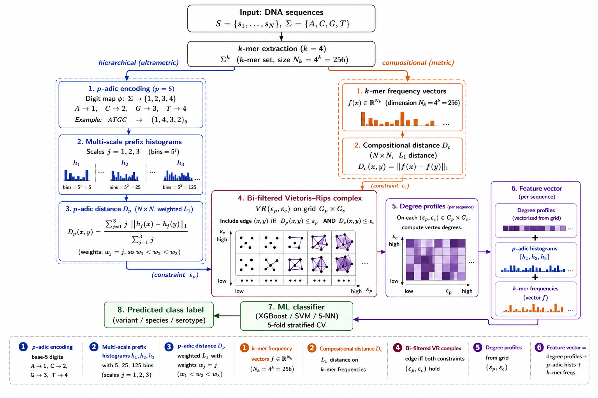

## pVR: p-adic Bi-Filtered Simplicial Complexes for Genomic Classification

Code and data for the paper *p-adic Bi-Filtrations for Topological Machine
Learning on Genomic Sequences*.

<p align="center">
  
</p>
<p align="center">
  <sub>Overview of the pVR pipeline. The figure is adapted from Figure 3 of the paper.</sub>
</p>

### Notation

The code uses `D_H` for the compositional distance matrix (L1 distance on
k-mer frequency vectors); the paper denotes this `D_c`. Same object.

### Requirements

A full conda environment is given in `pvr_env.yml`, but it includes many
extra packages. Minimally, the pipeline needs: 
`numpy`, `scipy`, `scikit-learn`, `xgboost`, `gudhi`, `joblib`, `biopython`, `pandas`.

The Nucleotide Transformer comparison (`nt_compare.py`) additionally needs
`torch`, `transformers`, and `umap-learn`. Plotting needs `matplotlib`.

GUDHI is easiest via conda: `conda install -c conda-forge gudhi`.

### Data

The benchmark sequences and labels are included under `data/` (low-sample)
and `data_large/` (large-sample). To rebuild them from NCBI instead, see
`download_data.py` and `download_large.py` (an NCBI Entrez email is required).

### Running

Full pipeline (main results, ablations, sensitivity) on each regime:

```bash
python run_full_eff.py --datadir data/       --outdir results/
python run_full_eff.py --datadir data_large/ --outdir results_large/ --skip_sensitivity
```

Each dataset completes in seconds on a 12-core CPU; no GPU is needed.

### Reproducing the tables

```bash
python make_tables_ci.py   --small results/all_results.json \
                           --large results_large/all_results.json --out tables_ci.tex
python make_aux_tables.py  --small_results results/all_results.json \
                           --large_results results_large/all_results.json \
                           --small_data data/ --large_data data_large/
```

Precomputed results are in `results/all_results.json` and
`results_large/all_results.json`.

### Files

- `pvr_eff.py` — core method (encoding, distances, bi-filtration, classification)
- `baselines.py` — FFP-JS, NVM, MinHash baselines
- `run_full_eff.py` — full experiment pipeline
- `nt_compare.py` — Nucleotide Transformer v2 comparison
- `make_tables_ci.py`, `make_aux_tables.py` — regenerate paper tables
- `plot_results.py`, `make_figure.py` — figures
- `download_data.py`, `download_large.py` — NCBI data acquisition

### Citation

If you use this code or data, please cite our paper:

```bibtex
@article{dash2026pvr,
  title   = {$p$-adic Bi-Filtrations for Topological Machine Learning on Genomic Sequences},
  author  = {Dash, Tirtharaj and Sachdeva, Gunja},
  journal = {arXiv preprint arXiv:2606.06117},
  year    = {2026},
  doi     = {10.48550/arXiv.2606.06117}
}
```